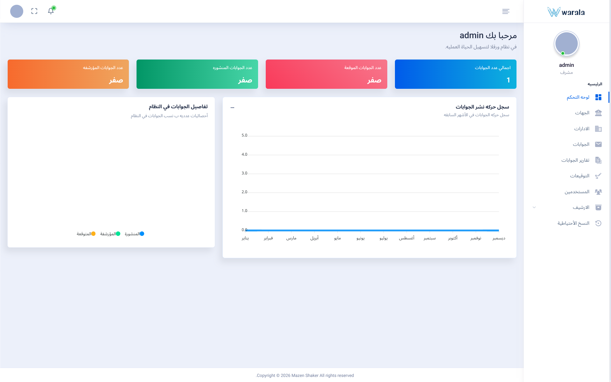
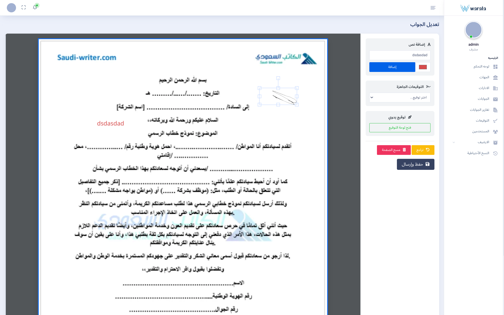
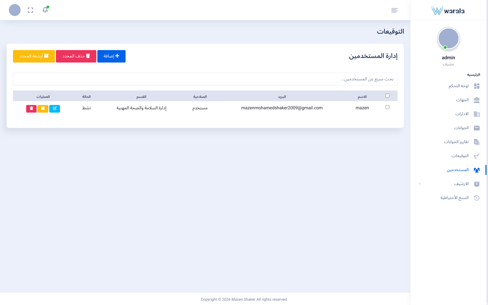
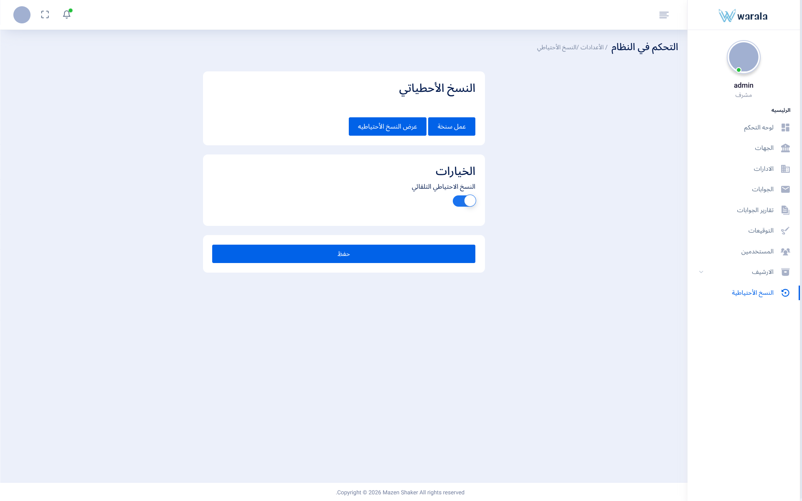
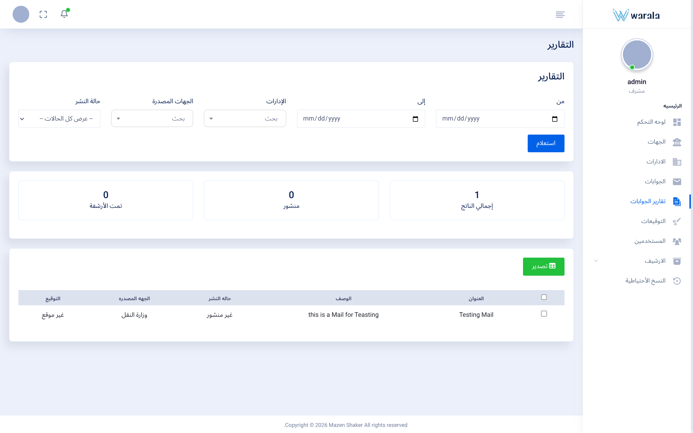

# Archive Mail

A digital correspondence and document management system designed to replace manual internal document delivery workflows within organizations.

Archive Mail allows organizations to receive correspondence from external entities, digitize it, process it internally, and distribute it to the appropriate departments through a controlled internal workflow.

Instead of physically copying documents, sending them through employees, or relying on informal communication channels, a document can be uploaded to the system, processed, annotated or signed, and then sent directly to the relevant departments.

## Overview

Organizations often receive documents and correspondence from external entities such as ministries, companies, institutions, and other organizations.

Archive Mail provides an internal workflow for handling these documents:

1. A document is received from an external entity.
2. The document is uploaded to Archive Mail.
3. The responsible employee processes the document inside the system.
4. The document can be edited, signed, annotated, or otherwise handled as required.
5. The employee selects the departments that should receive the correspondence.
6. The correspondence is sent through the system.
7. Users within the selected departments receive the correspondence through their inbox.
8. Authorized users can then view and process the document according to their responsibilities.

This workflow reduces unnecessary physical document movement and provides a centralized way to manage internal correspondence.

## Screenshots

### Dashboard



### Correspondence & Signing



### User Management



### Backup Management



### Reports 




## Features

### Correspondence Management

The core of Archive Mail is its internal correspondence workflow.

Users can work with incoming documents and route them to the appropriate departments without relying on manual document delivery between employees.

Correspondence can be processed within the application before being distributed to the selected departments.

### Inbox System

Each user has access to the correspondence relevant to them through an internal inbox.

When a correspondence is sent to a department, users belonging to that department can access the document through the system.

This provides a centralized alternative to manually forwarding documents between employees.

### Document Processing

Documents can be uploaded and handled directly inside the system.

Depending on the workflow, users can:

* Upload documents
* View documents
* Edit documents
* Add annotations
* Sign documents
* Send documents to departments
* Manage document attachments

### User Management

Administrators can manage users and their access to the system.

The user management system provides administrative control over accounts and their assigned permissions.

### Roles & Permissions

Archive Mail uses role-based access control to determine what users can access and what actions they can perform.

The main roles currently include:

**Administrator**

Administrators have broad access to system functionality and can manage users, permissions, correspondence, and other administrative operations.

**User**

Regular users have access to their own account and the correspondence available to them through the system.

Authorization is enforced at the application level using Laravel's authorization mechanisms.

### Real-Time Notifications

Archive Mail uses Laravel Reverb to provide real-time notifications.

Users can receive notifications without relying on manual page refreshes, allowing important correspondence and system events to be communicated immediately through the application.

### Fast Search

The application includes a reusable `Searchable` trait for live searching.

Search functionality can operate across model fields as well as fields belonging to related models, allowing different parts of the application to reuse the same search abstraction.

### Reports

Archive Mail includes reporting functionality for working with system and correspondence data.

Reports provide administrators and authorized users with a way to inspect and work with the information stored within the system.

### Attachments

Correspondence can contain associated attachments, allowing related documents and files to remain connected to the correspondence they belong to.

### Archiving & Restoration

Archive Mail includes functionality for archiving stored correspondence and restoring archived data when required.

This allows older correspondence to be retained without keeping everything in the active workflow.

## Architecture

Archive Mail is built around a Laravel application architecture with an emphasis on separating business logic, authorization, background processing, and reusable functionality.

### Service Layer

Business operations are organized through service classes rather than placing all application logic directly inside controllers.

This keeps controllers focused on handling HTTP requests while allowing application-specific operations to remain isolated and reusable.

### Searchable Trait

The application contains a reusable `Searchable` trait that provides a common search mechanism across different models.

The trait supports searching model attributes and relevant relationship fields, allowing live search functionality to be reused without duplicating the same query logic throughout the application.

### Authorization

Authorization is handled through Laravel Gates and Policies together with the application's roles and permissions system.

Access control is enforced at the application level rather than relying solely on interface-level restrictions.

### Middleware

Middleware is used to enforce application-level requirements such as session validation and disabled-account enforcement.

This allows account state and access requirements to be checked consistently across protected application routes.

## Redis

Redis is used in multiple parts of Archive Mail.

### Caching

Frequently accessed data can be cached using Redis to reduce unnecessary database operations and improve the responsiveness of the application.

Caching is applied selectively rather than indiscriminately.

### Sessions

Redis is also used as the session store, allowing session data to be handled outside the application's database.

## Queued Processing

Archive Mail uses queued jobs for operations that do not need to block the user's normal request.

Backup and restoration operations are handled through queued jobs, allowing potentially expensive operations to run independently from the main web request.

## Backup System

Archive Mail includes a dedicated backup and restoration workflow.

Backups can be triggered manually through the application, while automatic database backups are handled separately from normal user requests.

The automatic backup workflow consists of:

```text
systemd timer
      ↓
systemd service
      ↓
backup command
      ↓
database backup
```

The scheduled system-level job currently runs every **10 days**.

Backup and restoration operations are processed through queued jobs where appropriate.

## Technology Stack

| Technology     | Purpose                    |
| -------------- | -------------------------- |
| PHP 8.5.4      | Backend language           |
| Laravel 13.0   | Application framework      |
| MariaDB 11.8.6 | Relational database        |
| Redis          | Caching & sessions         |
| Laravel Reverb | Real-time notifications    |
| Laravel Queues | Background processing      |
| systemd        | Scheduled backup execution |

## Design Considerations

Archive Mail was designed with larger deployments in mind, with a target architecture intended to support deployments of up to **10,000 users**.

This figure is a **design target, not a benchmark**. The project does not claim that the current implementation has been load-tested or benchmarked with 10,000 concurrent users.

Several architectural decisions support this target:

* Service-layer separation
* Reusable search abstractions
* Selective caching
* Redis-backed sessions
* Queued background operations
* Real-time event delivery
* Application-level authorization
* System-level scheduling for recurring tasks
* Separation of administrative and regular-user capabilities

## Application Workflow

The primary correspondence workflow can be summarized as:

```text
External Entity
      │
      ▼
Document Received
      │
      ▼
Upload to Archive Mail
      │
      ▼
Process / Edit / Annotate / Sign
      │
      ▼
Select Target Departments
      │
      ▼
Send Correspondence
      │
      ▼
Department Inbox
      │
      ▼
Authorized Users
      │
      ▼
Process Correspondence
```

This workflow is designed to reduce unnecessary physical movement of documents while keeping correspondence inside a controlled system.

## Project Structure

The project follows Laravel's application structure while introducing dedicated services, jobs, policies, middleware, and reusable components where appropriate.

Key application areas include:

```text
app/
├── Http/
│   ├── Controllers/
│   ├── Middleware/
│   └── Requests/
├── Jobs/
├── Models/
├── Policies/
├── Services/
└── ...

public/
└── assets/
    └── screenshots/

resources/
└── views/

routes/
└── ...
```

## Current Status

Archive Mail is a working application developed around a real internal correspondence workflow.

The project currently focuses on:

* Internal correspondence management
* Department-based document routing
* Document processing
* User management
* Roles and permissions
* Inbox workflows
* Search
* Real-time notifications
* Reports
* Attachments
* Archiving and restoration
* Backup and recovery
* Background processing
* Application-level access control

The architecture may continue to evolve as additional requirements and real-world usage are introduced.

## Notes

Archive Mail was built as a practical backend-focused system rather than a simple CRUD demonstration.

The project explores how a Laravel application can handle a multi-step business workflow involving users, departments, documents, authorization, search, real-time communication, background processing, caching, and operational backup workflows.

The 10,000-user figure mentioned above represents an architectural design target and should not be interpreted as a measured performance result.

## License

No open-source license has currently been assigned to this project.

